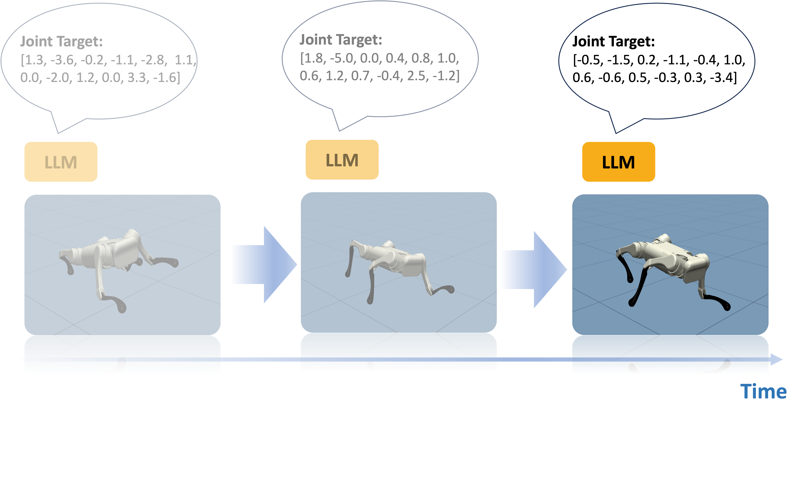

# Prompt a Robot to Walk with Large Language Models

This repository contains the code for our paper [Prompt a Robot to Walk with Large Language Models](https://arxiv.org/abs/2309.09969) by [Yen-Jen Wang](https://wangyenjen.github.io/), [Bike Zhang](https://bikezhang106.github.io/), [Jianyu Chen](http://people.iiis.tsinghua.edu.cn/~jychen/), and [Koushil Sreenath](https://hybrid-robotics.berkeley.edu/koushil/).

## Overview


The LLM directly outputs the low-level action to make a robot to walk. In our experiment, the LLM is supposed to run at 10 Hz although the simulation has to be paused to wait for LLM inference, and the PD controller executes at 200 Hz.

## Setup

### Create conda env:

```shell
conda create -n prompt2walk python=3.9
conda activate prompt2walk
```

### Requirements

```shell
pip install -r requirements.txt
```

## Usage

### Configuration

Please fill the `openai.api_key` in `src/llm.py`.

### Collect the trajectory from the LLM controller

```shell
python src/run.py
```

### Replay the trajectory

```shell
python src/replay.py
```

## Training your own policy

Please refer to [Isaac Gym Environments for Legged Robots](https://github.com/leggedrobotics/legged_gym). Currently, we've tested our code on A1 and ANYmal C Robot at 10 Hz.

## Want more details?
Please read our paper! If you have further questions, please feel free to contact [Yen-Jen](https://wangyenjen.github.io/).

## Citation

Please cite our paper if you use this code or parts of it:
```
@article{wang2023prompt,
  title={Prompt a Robot to Walk with Large Language Models},
  author={Wang, Yen-Jen and Zhang, Bike and Chen, Jianyu and Sreenath, Koushil},
  journal={arXiv preprint arXiv:2309.09969},
  year={2023}
}
```
